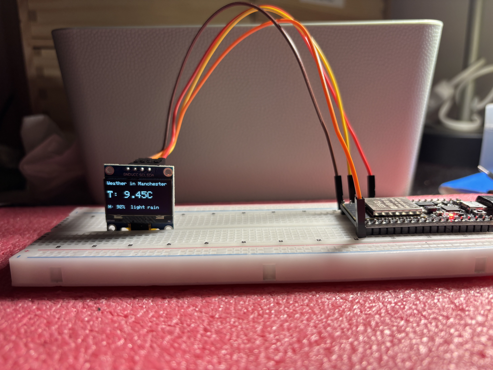

# ESP32 Weather Display on OLED

## Project Overview

This project uses an **ESP32** to fetch **live weather data** for **Manchester** from the **OpenWeatherMap API** and display the **temperature, humidity, and weather description** on an **I²C OLED (SSD1306)** screen.
The data is also printed to the **Serial Monitor** for debugging.

---

## Components Used

* ESP32 Dev Board
* SSD1306 I²C OLED Display
* Jumper wires

---

## Wiring

### OLED Display (I²C)

| OLED Pin | ESP32 Pin |
| -------- | --------- |
| **VCC**  | 3.3V      |
| **GND**  | GND       |
| **SDA**  | GPIO 21   |
| **SCL**  | GPIO 22   |

**Important Notes**

* OLED uses **3.3V**, not 5V
* GPIO 21 & 22 are the ESP32 default I²C pins

---

## Libraries

* `WiFi.h` – for ESP32 WiFi connectivity
* `HTTPClient.h` – for making HTTP GET requests to the API
* `ArduinoJson.h` – for parsing JSON data from OpenWeatherMap
* `Adafruit GFX Library`
* `Adafruit SSD1306`

---

## Setup Instructions

1. **Install Libraries** in Arduino IDE:

   * `ArduinoJson`
   * `Adafruit GFX Library`
   * `Adafruit SSD1306`
   * `HTTPClient` and `WiFi` are built-in for ESP32

2. **Update WiFi Credentials**

```cpp
const char* ssid = "YOUR_WIFI_NAME";
const char* password = "YOUR_WIFI_PASSWORD";
```

3. **Update Weather API Key**

```cpp
const char* apiKey = "YOUR_WEATHER_API_KEY";
const char* city = "Your_city";
```

4. **Upload the Sketch** to ESP32 using Arduino IDE or PlatformIO.

5. **Open Serial Monitor** (115200 baud) to see debug logs.

---

## How It Works

1. ESP32 connects to WiFi.
2. Sends a GET request to **OpenWeatherMap API** for Manchester’s weather.
3. Parses the **JSON response** for temperature, humidity, and weather description.
4. Displays the information on the **OLED screen**.
5. Updates every **10 minutes**.
```cpp
delay(600000); // 10 minutes
```
<p align="center">
  
</p>

* The **OLED is monochrome**, so only text size and positioning can be adjusted for readability.
